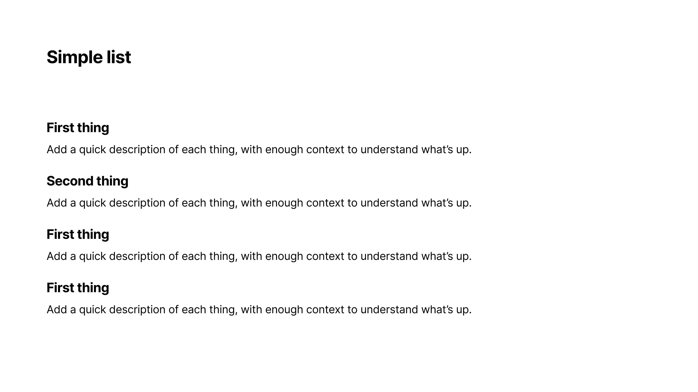
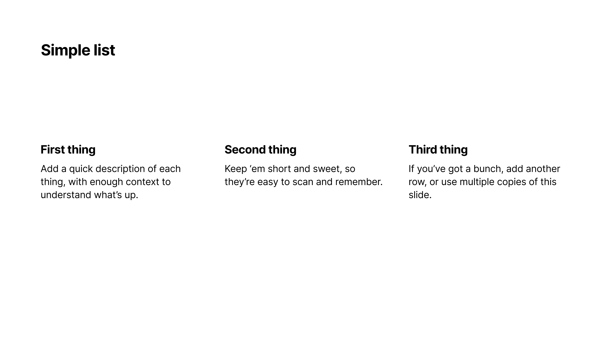
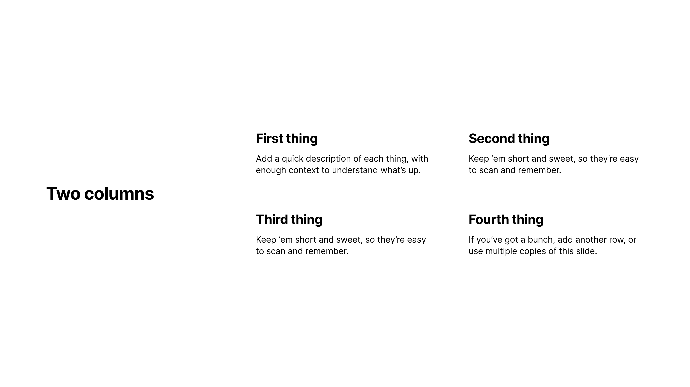
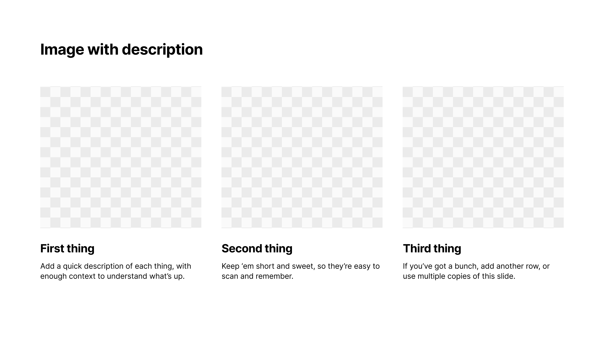
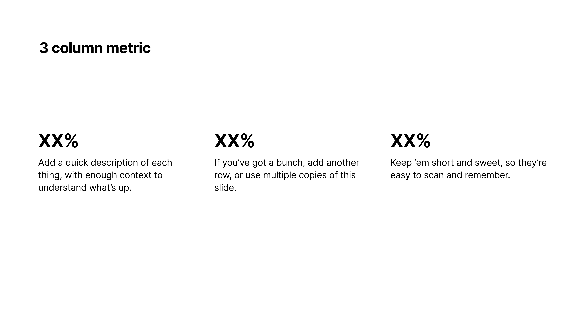
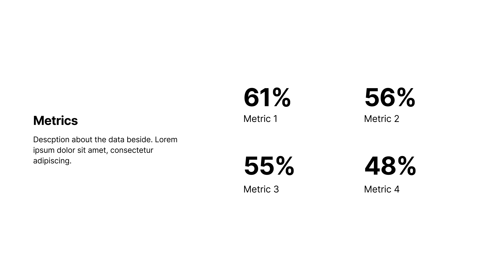
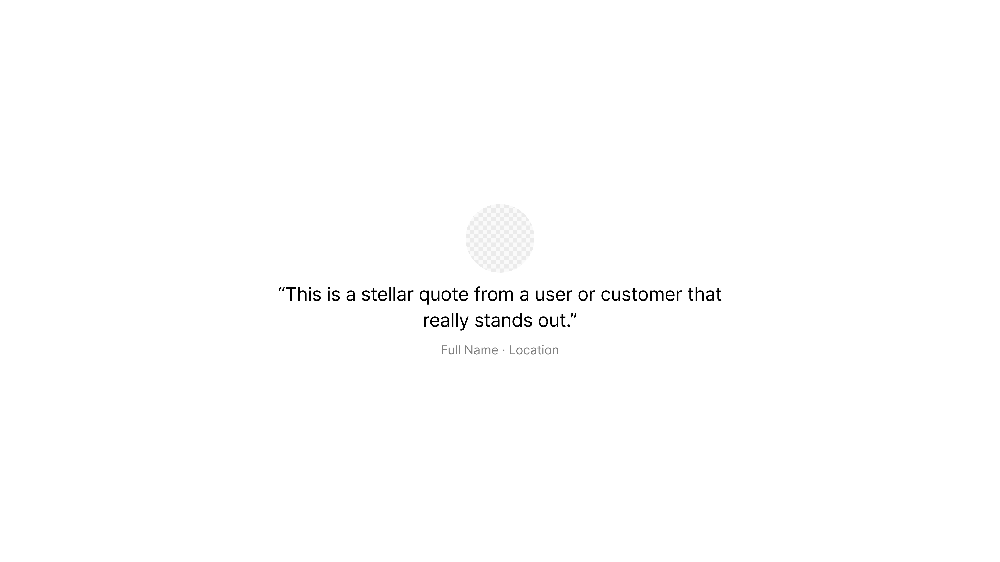

# Marp 슬라이드 템플릿 카탈로그

이 문서는 사용 가능한 모든 슬라이드 템플릿을 보여줍니다.

## 1. 타이틀 슬라이드 (Title Slide)

**설명**: 프레젠테이션의 첫 번째 슬라이드로, 제목과 부제목을 표시합니다.


---

## 2. 섹션 제목 (Section Title)

**설명**: 새로운 섹션을 시작할 때 사용하는 제목 슬라이드입니다.


---

## 3. 단일 컨텐츠 (Single Content)

**설명**: 하나의 주요 컨텐츠나 메시지를 강조하는 레이아웃입니다.


---

## 4. 두 컬럼 레이아웃 (Two Column)

**설명**: 내용을 두 개의 컬럼으로 나누어 표시하는 레이아웃입니다.


---

## 5. 세 컬럼 레이아웃 (Three Column)

**설명**: 내용을 세 개의 컬럼으로 나누어 표시하는 레이아웃입니다.


---

## 6. 이미지 중심 (Image Focused)

**설명**: 이미지를 중심으로 배치하고 텍스트를 보조적으로 표시하는 레이아웃입니다.



---

## 7. 차트/그래프 (Chart/Graph)

**설명**: 데이터 시각화를 위한 차트나 그래프를 표시하는 레이아웃입니다.



---

## 8. 비교/대조 (Comparison)

**설명**: 두 가지 이상의 항목을 비교하거나 대조할 때 사용하는 레이아웃입니다.



---

## 9. 프로세스/플로우 (Process/Flow)

**설명**: 프로세스나 워크플로우를 단계별로 표시하는 레이아웃입니다.


---

## 10. 팀/조직도 (Team/Organization)

**설명**: 팀 멤버나 조직 구조를 표시하는 레이아웃입니다.


---

## 11. 타임라인 (Timeline)

**설명**: 시간 순서대로 이벤트나 마일스톤을 표시하는 레이아웃입니다.


---

## 12. 통계/메트릭스 (Statistics/Metrics)

**설명**: 통계 데이터나 핵심 메트릭스를 표시하는 레이아웃입니다.



---

## 13. 인용구 (Quote)

**설명**: 중요한 인용구나 명언을 강조해서 표시하는 레이아웃입니다.



---

## 14. 메트릭스 그리드 (Metrics Grid)

**설명**: 좌측에 설명 텍스트, 우측에 2x2 그리드로 메트릭스를 표시하는 레이아웃입니다. 현재 `marp_example.md`에서 사용 중인 템플릿입니다.



**사용 예시**:
```markdown
<div class="container">
  <div class="left-col">
    <h2>Metrics</h2>
    <p>Description about the data beside.</p>
  </div>
  <div class="right-col">
    <div class="metric-item">
      <h2>61%</h2>
      <p>Metric 1</p>
    </div>
    <div class="metric-item">
      <h2>56%</h2>
      <p>Metric 2</p>
    </div>
    <div class="metric-item">
      <h2>55%</h2>
      <p>Metric 3</p>
    </div>
    <div class="metric-item">
      <h2>48%</h2>
      <p>Metric 4</p>
    </div>
  </div>
</div>
```

---

## 15. 종료/감사 (Closing)

**설명**: 프레젠테이션을 마무리하거나 감사 인사를 전하는 슬라이드입니다.



---

## 사용 방법

각 템플릿을 사용하려면 `marp_example.md` 파일을 참고하여 새로운 마크다운 파일을 만들고, 원하는 템플릿의 레이아웃을 적용하세요.

**기본 구조**:
```markdown
---
marp: true
theme: custom-style
---

<!-- 슬라이드 내용 -->
```

